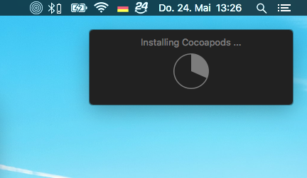
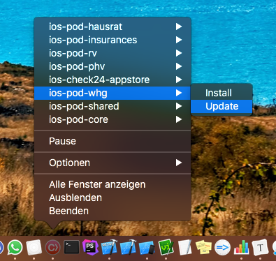
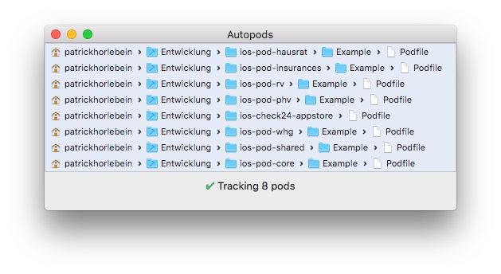

`Autopods` tracks the git repository of your pods and automatically triggeres a
`pod install` when needed (e.g. when you change branches). The `pod install` will only be
triggered when it is actually needed and you would get an "out of sync" error in
Xcode anyway.

If for some reason the `pod install` command fails, the error will be
displayed together with a button to spawn a Terminal window in the pods folder.

If you need to manually run `pod install` or `pod update`, you can use the dock
menu to trigger that.

